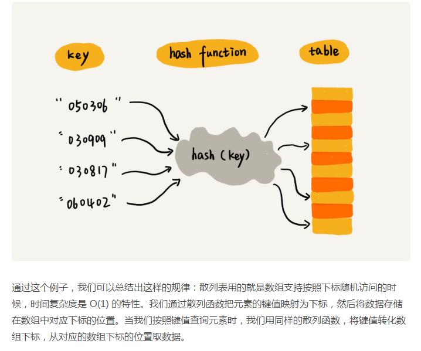
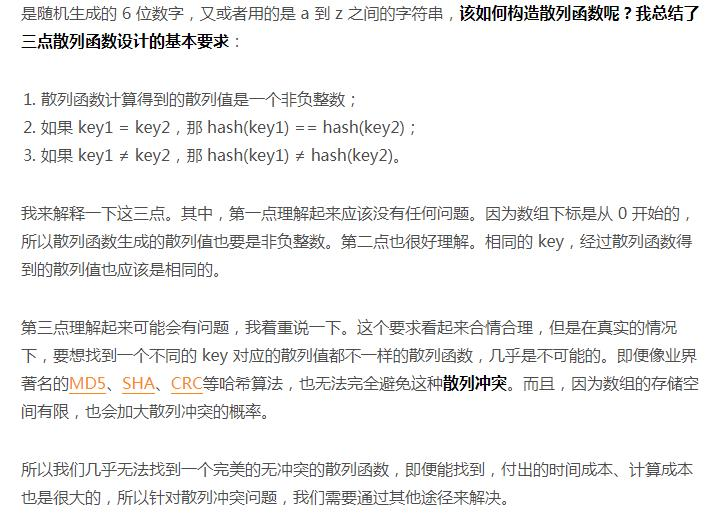
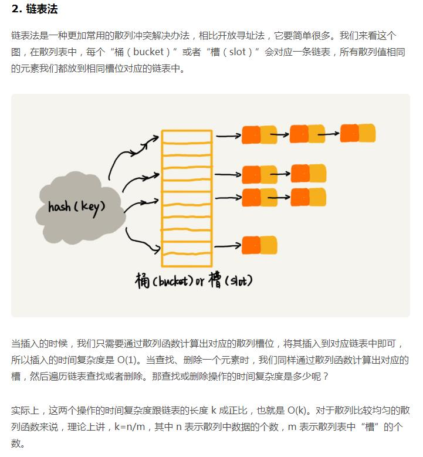

# 数据结构

## 一、知识结构

**重点**：
* 数据结构：数组、链表、栈、队列、散列表、二叉树、堆、跳表、图、Trie；
* 算法：递归、排序、二分查找、搜索、哈希算法、贪心算法、分治算法、回溯算法、动态规划、字符串匹配算法；

### 算法执行效率及资源消耗
#### 1、大O复杂度表示方法

* 读数据 - 运算 - 写数据；
* 所有代码执行时间T(n)与每行代码的执行次数n成正比；

#### 2、时间复杂度分析
* 只关注**循环执行**次数最多的一段代码；

* 加法准则：总的时间复杂度等于量级最大的代码的时间复杂度;
  > O(n\*n) = O(n\*n) + O(n) + O(1)

* 乘法准则：嵌套代码的复杂度等于嵌套内外代码复杂度的乘积；

## 算法

### 散列表(Hash Table)

> **散列表用的是数组支持按照下标随机访问数据的特性，所以散列表其实就是数组的一种扩展，由数组演化而来。可以说，如果没有数组，就没有散列表。**
* 散列思想：
> 键(key) - 散列函数(hash function) - 散列值(hash值)；
> 
* 散列函数：
> 
* 散列冲突：
> * 开放寻址法；
> * 链表发：

### 字符串匹配算法

#### BF(Brute Force)算法
* 原理：暴力解法，模式串(m)与主串(n)循环匹配；
* 复杂度：O(n * m)
* 尽管理论上，BF 算法的时间复杂度很高，是 O(n*m)，但在实际的开发中，它却是一个比较常用的字符串匹配算法。为什么这么说呢？：
    > 第一，实际的软件开发中，大部分情况下，模式串和主串的长度都不会太长。而且每次模式串与主串中的子串匹配的时候，当中途遇到不能匹配的字符的时候，就可以就停止了，不需要把 m 个字符都比对一下。所以，尽管理论上的最坏情况时间复杂度是 O(n*m)，但是，统计意义上，大部分情况下，算法执行效率要比这个高很多。
    > 
第二，朴素字符串匹配算法思想简单，代码实现也非常简单。简单意味着不容易出错，如果有 bug 也容易暴露和修复。在工程中，在满足性能要求的前提下，简单是首选。这也是我们常说的KISS（Keep it Simple and Stupid）设计原则;
    > 

#### RK(Rabin-Karp)算法:
* 

